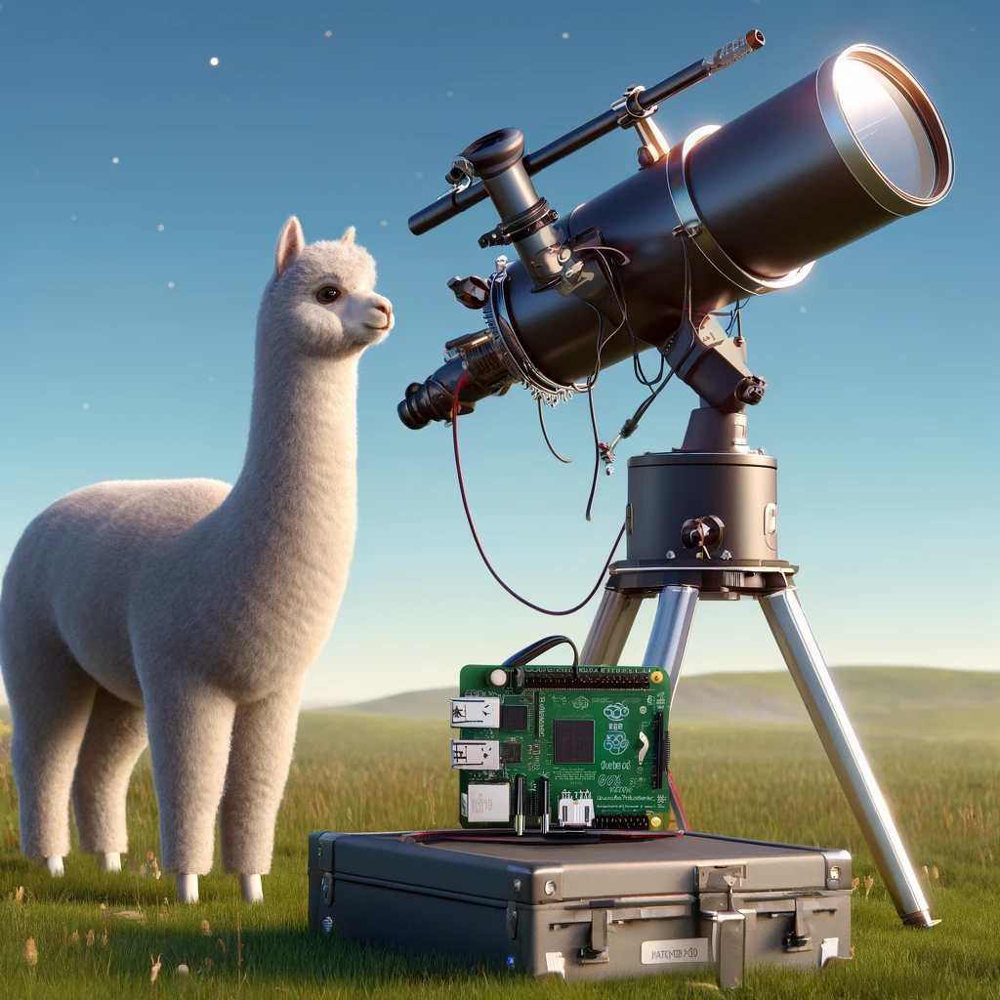
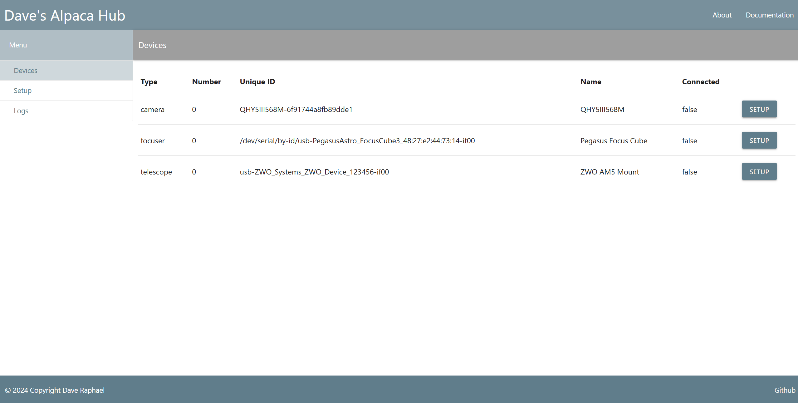
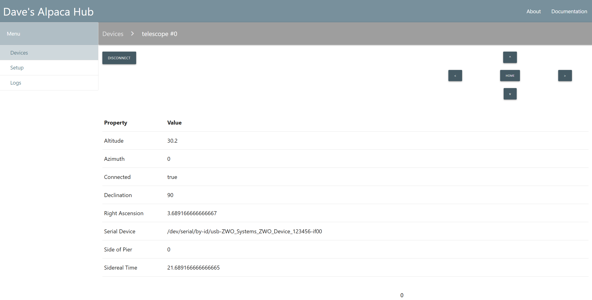

# Alpaca Hub



With a focus on astrophotography use cases, Alpaca Hub is an open
source ASCOM Alpaca server that provides structure and implementation
for running one or more devices directly connected via USB or Serial
as exposed and discoverable via the Alpaca Protocol specified here -
https://www.ascom-standards.org/AlpacaDeveloper/Index.htm.

One of the broader goals of this project is to make sure that ASCOM
Alpaca is more generally available for people that want to leverage
network attached astronomy gear. I really think that the folks over at
ASCOM have done an amazing job of carrying the torch around
interoperability in Astronomy equipment for a long time now.

For example, my favorite astrophotography software is
[NINA](https://nighttime-imaging.eu/). NINA has excellent support for
ASCOM and also the Alpaca protocol which is actually the original
reason I decided to implement this!

But this is certainly not the only useful situation where one might
want to use Alpaca Hub.

In order to understand where Alpaca Hub sits in the landscape of
software for astrophotography, I will walk through a bit more of the
potential scenarios that people may have.

## Use cases and where Alpaca Hub fits in the ecosystem

In general, all devices that an astrophotographer wants to control
and/or automate, we need the ability to connect such a device to a
computer / appliance that has USB and/or serial ports. The computer /
appliance that the device is connected must be have a driver which is
a piece of software that understands the devices native protocol. Many
of the vendors provide native SDKs, ASCOM / Alpaca, INDI, or Indigo
drivers. Additionally, the open source communities also provide such
drivers when the vendor does not.

We are definitely living in an era where there are so many different
options that most use cases _are_ supported with current options.

For many, simply running a Windows laptop connected to the imaging
equipment will be the easiest and most simple approach. If this is
you, there probably is not a need to complicate things by adding
network based connectivity such as Alpaca Hub.

However, for many of us, we want / need to run our equipment attached
to one or more devices which introduces the "networked" aspect.

There are already a lot of options for those that have the networked
use case for their astrophotography gear. For example, if one is happy
running Windows on all of the devices that their equipment connects -
there is no need for Alpaca Hub. This is fully supported now through
ASCOM Remote. ASCOM Remote allows the all of the various ASCOM native
drivers to be exposed as Alpaca devices today.

And also, if folks are wanting to run Linux on their devices - INDI
and Indigo also support network based solutions. These are also
amazing initiatives that have done a phenomenal job of expanding the
amount of possible ways we can connect and manage / automate our gear.

But I found that there is a particular set of use cases which none of
these options seem to provide at the moment. I really want an Operating
System agnostic solution where I can pick and choose what I want to run
for my automation and acquisition vs which operating system is running
on the devices I'm connecting my equipment.

As I mentioned earlier, I _love_ NINA as a platform for automating my
imaging. It currently only runs on Windows. What I found is that NINA
has strong support for Native Drivers via the Vendors' SDKs, ASCOM,
and ASCOM Alpaca. However, native Alpaca support for devices was
lacking. I will give a shout out to Pegasus Astro
on this one as they have definitely embraced implementing the
different standards on their devices to maximize support for these use
cases.

However, for those that _love_ Kstars / EKOS, Alpaca Hub is not for
you. The INDI folks have absolutely solved this in a cross platform
way.

Where Alpaca Hub aims to provide additional coverage is for use cases
where a vendor has not provided native Alpaca support AND a user wants
to run their devices attached to a Linux based device such as
Raspberry Pi or many other potential options as opposed to being
directly attached to Windows native device.

Additionally, I mentioned before, I'd like to make supporting the
general use case of native Alpaca support easier for vendors
potentially through this commercially friendly open source project.
Vendors are free to use this project however it may benefit
them. But since they already provide SDKs, I also want it to be really
easy for the community to provide Alpaca support as well.

## FAQ

If anything is missing from this list, please don't hesitate to file
a GitHub issue requesting an answer to a question.

### How is this different from ASCOM Remote?

ASCOM remote is a Windows based application that allows one to easily
expose any device that supports ASCOM as an Alpaca device. Therefore,
if one is running Windows as the operating system which their devices
are attached, I strongly recommend using ASCOM Remote to expose these
devices as it is very mature and will get the job done.

Where Alpaca Hub differs is that it is intended to be hub that exposes
non-ASCOM native or non-Windows connected devices as Alpaca devices.

### How do I get support added for my device?

1. I am happy to actually implement drivers for devices I do not
   own. Please submit a GitHub issue if you have a desire for a
   specific device to be supported.
2. If you are a coder and want to implement support, please reach out
   to me and I'm happy to help / walk through questions and accept PRs
   for device support.

### What is supported now?
At the moment, the list of hardware supported is not huge, but I have
written drivers for the hardware I have at home:
- QHY cameras (mono) and attached Filterwheels
  - Specific QHY Hardware I've tested:
    - QHY9M + FW
    - QHY5II-L-M
    - QHYIII568M
    - QHYIII585M
    - QHY268M
    - QHY Filterwheel 3
- PlayerOne Cameras (should work with any PlayerOne camera)
  - Uranus-C 585
  - Apollo Max
- ZWO AM5/AM3 Mount
- Pegasus FocusCube 3
- Pegasus Pocket Power Box Advanced (gen2 tested)
- PrimaLuceLabs Esatto Robotic Focuser
- PrimaLuceLabs ARCO Rotator
- (Testing...) Warp Astron WD-20 (should work with any Onstep device I think...)

Everything that I've implemented so far has passed the Alpaca Conform tests
without issues except for guiding on the declination axis on the AM5. I
believe that I am emulating the behavior of the official ZWO ASCOM driver on
this, so I'm not sure if this is a specific issue related to how ZWO has
implemented their firmware.

Alpaca Hub also implements the discovery protocol as well which is one
of my favorite parts of the Alpaca protocol.

Also, there is not a binary distribution at the moment, but that is on
the short list of things to get done.

However, it is not hard to build from scratch if you are so
inclined. See the build instructions later in this README for details.
Please reach out to me through an issue on Github if you have any issues
compiling the project.

## Running Alpaca Hub

```
Usage: AlpacaHub [OPTION]...
Open Source Alpaca Implementation

  -h                     Displays this help message

  -l LEVEL               Set the log to LEVEL:
                           1 - INFO (default)
                           2 - DEBUG
                           3 - TRACE
                           4 - TRACE +

  -t THREAD_COUNT        Sets the number of concurrent threads
                         for the web server. 4 threads is the default.

  -d                     Disable Alpaca Discovery

  -p PORT                Sets the web server to listen on

                         PORT. Default is port 8080
  -cw                    Enable ClientID and ClientTransactionID warnings

  -ac                    Auto-connect devices on startup

  -ov                    Force camera offset value mode

  -gv                    Force camera gain value mode
```

Here are some screen shots of the web interface:




As the project matures, I definitely plan on ensuring that there is good
documentation. And I would absolutely appreciate any contributions towards
this.

## Shoulders of Giants

It is very important to me that I acknowledge the work that this has been
built on top of.

Specifically, the following are major projects / products that have
been crucial in building this tool:

- ASCOM
- INDI
- Indigo
- AlpacaPi
- PixInsight

## Background / Intent of System

Just for those that are curious as to "why are you building this?"

When I originally started this, I was simply mildly frustrated with
the lack of Alpaca implementations for the astronomy hardware I like
to use. So I said to myself "don't complain, just build what you need."

I wanted to be able to setup my imaging system in a way that "makes
sense to me." Years ago I started a project that implemented image
acquisition on top of PixInsight, but I abandoned it due to lack of
free time. Back then, I had imagined I would use PixInsight for as
much of my astrophotography imaging needs as possible. I _may_ revisit
that some point in the future, but I'm not sure it makes sense at this
point.

Also, a _big_ motivation for this project is scratching my itch to
write some code for astrophotography. There are more projects than
ever, so I can't exactly claim that this project will be better or
have any particular advantage. However, I do feel strongly about making
a system that is easy to extend. That is one of the main goals of this
project: **It should be very easy to add support for additional drivers**

I personally want to be able to do the following:
- More or less fully automate my image acquisition from the point that
  equipment is powered up, mount is polar aligned, etc... (this is not
  by itself a reason to make something like this...)
- Be able to mix and match components from the standpoint of not
  everything relying on one computer
- treat my astronomy devices like little network attached systems with
  some ultimate dream of having queues / resilience during network
  interruptions...
- I want to have most if not all of my astro imaging gear working as
   members of a network of IoT devices
- I want to connect from NINA to my devices for automation and control
- I don't want to have any of my devices physically connected to my
  NINA instance
- In order to do this, I think the ASCOM Alpaca standard makes sense

## Design and Implementation

### Code Style
I think I'm going to try and stick to Google's C++ guide:
https://google.github.io/styleguide/cppguide.html. However, I don't
necessarily think it needs to compulsively adhered to.

### Architecture

Alpaca Hub aims to keep things as simple as possible. I have laid out
the project as follows:

#### Server

The web server is implemented on top of
[Restinio](https://stiffstream.com/en/docs/restinio/0.7/) which is a
C++ project for building HTTP based web servers. I have blended a
combination of leveraging the Express style routing along with the
Easy Parser approach. This allows Alpaca Hub to easily map rest calls
to the interface design of the various Alpaca interfaces along with
the usual paramater parsing and general http plumbing in a way that
I believe is pretty straight forward and easy to understand.

#### Interfaces
There are 6 key "interfaces" defined as abstract c++ classes for
Alpaca Hub as it sits today:
- Camera
- Filterwheel
- Telescope
- Focuser
- Rotator
- Switch

The interface generally mimics what Alpaca / ASCOM prescribe.

They all live in the `src/interfaces` directory of the project.

Anyone that wants to provide a specific implementation will need
to implement these abstract classes for their specific hardware.

#### Drivers

The drivers are all implemented as concrete classes against the
interfaces. They all live in the `src/drivers` folder.

#### General "theory of operation"

The overall intent of the system was to provide a common web interface
that implements the requisite Alpaca endpoints. The web endpoints tie
back to the generic interface specification as described by each of
the interfaces in the `src/interfaces` directory.

Currently, the concrete implementations expose a class level static
method that is used to interrogate what devices are available and then
populates the list of devices connected. In the future, this may need
to be revisited in order to support a more sophisticated approach to
having multiple concrete implementations against the interfaces.

The current code is fairly static at the moment in that it
interrogates each of the implementations for what devices are
available.

As previously mentioned in the usage - there is a static number of
threads configured for the web server that responds and dispatches to
the concrete implementations of the drivers. However, it is intended
that the server implementation does not "know" any implementation
specific details about how a device operates.

### Other Alpaca devices
- What is the pattern for another remote alpaca device?
  - I don't think I should handle this use case actually...
  - I think that this is a simple hub that can host one or more
    directly connected devices to the system it is running on

## Decision Rationale

### Why C++?

I debated whether or not to implement this with a higher level language
such as Rust or C#.

Ultimately, given how far C++17 and beyond have come, I find that C++
is still one of the ultimate gold standards in terms of cross-platform
and high performance. Additionally, most of the vendor SDKs support C++
and so I hope that this makes it attractive for contributions.

Additionally, as I've been implementing this, I have found that
C++ has been a very productive language striking a nice balance of
productivity with tight control over areas of code when needed.

### Why ASCOM Alpaca?

I found that Alpaca really struck a nice balance in leveraging http
with a simple REST API vs a proprietary network protocol.

Additionally, I've found that the ASCOM project in general has been
very successful in becoming the de facto standard when it comes to
interoperability across different software vendors. For a long time
it was just Windows. I think that Alpaca was a stroke of brilliance
to allow the project to become ubiquitous across all platforms while
retaining so much of the value that has already been created through
the ASCOM interface definitions.

#### What about INDI / Indigo?

I'm blown away with the INDI and Indigo projects. I think they have
created something fairly amazing, and I strongly recommend using those
if your use cases warrant that.

# Build notes

## Supported Hardware / OS

- Raspberry Pi 5 (it should work fine on Raspberry Pi 4 as well...but
  needs to be tested)

Initially, I've only been focused on building and running Alpaca Hub
on the Raspberry Pi 5. That said, I've been fairly meticulous about
writing C++ code that _should_ be portable. That, combined with CMake,
there really should be no big challenge compiling and running on other
platforms.

## Dependencies

TODO: Need to do a fresh from scratch build and double check all requirements
and enumerate them here

1. Download and install QHY SDK
2. Checkout Alpaca Hub locally

### Additional dependencies that must be installed

Alpaca Hub also requires the following development libraries:

``` bash
sudo apt-get install uuid-dev
sudo apt-get install libcurl4-gnutls-dev
```

### CMake

Alpaca Hub requires a at least CMake version 3.24 or newer. Some
distributions are on older versions, so here is the easiest way to
run a newer distribution of CMake:

In a directory of your choice, download the binary distribution of cmake:

``` bash
wget https://github.com/Kitware/CMake/releases/download/v3.28.6/cmake-3.28.6-linux-x86_64.sh
```

There is more than one way to do this, but one example is:

``` bash
cd /usr/local
# execute the sh file - it will prompt you with a couple of y/n questions.
#
# specifically, for the question about the path - I chose 'n' in order to
# install in /usr/local
```

## Build

Generate makefiles
``` bash
cmake -B build src
```

# TODOs and potential ideas:

## Potentially Cool / Random ideas
- Embed a lua interpreter
  - I like the idea of being able to have a cli console where I can interact
    with my gear. I've leveraged embedding lua in the past to support this
    kind of scenario, so it _might_ make sense to do that with this project.
- Create a sophisticated web app to run everything
  - This _might_ make more sense as a separate project...
- Use PCL (PixInsight Class Library) to support image "stuff"
- Create an Alpaca "proxy"
  - This only makes sense if the need arises...so far I'm not seeing one
- Add web based view of logs
  - This is probably a lot of work...and I'm not sure it is worth the effort
- ~~Write a web based planetarium :-) and leverage web asm / webgl/~~
  - Stellarium Web exists...and this is probably more of an insane
    idea than random or cool lol
- OpenPHD2 integration - https://code.google.com/archive/p/open-phd-guiding/wikis/EventMonitoring.wiki
- ~~Fork PHD2 ... perhaps create an alpaca native version?~~

Note: I need to move these to an issues list / tickets in Github

 - [x] Create web page for project with documentation on usage
 - [x] Add custom actions for QHY Cameras for USB Limit
 - [ ] Rewrite main.cpp so that device specific code is implemented
       inside of each driver class with validation that the device
       is even present
 - [ ] Add dynamic polling of devices being added / removed from the
       system
 - [ ] Go through all settings that are currently hard-coded and
       ensure that they are exposed as configuration
 - [ ] Implement persistent configuration
 - [ ] Build a downloadable version of this and create a release
 - [ ] Add github actions for build / execution of unit tests
       aka basic CI (Continuous Integration)
 - [x] Add Alpaca support to OpenPHD2
   - This is in my fork here: https://github.com/ceterumnet/phd2/tree/alpaca_support
 - [x] Write web server (restinio based)
 - [ ] Implement QHY Camera driver (color)
   - Note: I really need a QHY color camera to test this with...
 - [x] Implement QHY Camera driver (mono only)
    - [x] Achieve conformance with ASCOM Conform Tool
    - [x] Refactor implementation to clean up weirdness around
          initialization and general clumsyness of the code
 - [x] Implement QHY filter wheel driver
   - [x] Achieve conformance with ASCOM Conform Tool
 - [x] Implement Alpaca discovery
 - [x] Implement telescope mount driver
    - [x] Achieve conformance with ASCOM Conform Tool (there are a few
          issues to work through on this regarding pulseguide in dec
          axis)
 - [x] Implement Pegasus FocusCube3 focuser driver
 - [x] Implement PrimaLuceLabs Esatto focuser driver
 - [x] Implement PrimaLuceLabs ARCO focuser driver
 - [ ] Implement better descriptions in device driver implementations
 - [ ] Implement firmware version to data pulled into the device
       driver implementations
 - [ ] Implement support for logging to file as an option
 - [x] Implement CLI help
 - [x] Implement web screen for information
 - [x] Implement web setup screen for devices
 - [x] Implement Alpaca Management API
 - [x] Figure approach to test suite
 - [x] Cleanup error messages to follow consistent format
 - [x] Move device initializer code to be called on PUT connected
 - [x] Need to rethink templates for PUT requests for multiple values
 - [x] Check all device pointers for null (this could probably use a
       bit more robustness. However, I think it is adequate for now.
 - [x] Need to fix crash when invalid action is called on valid device
       type
 - [x] Need to figure out what the threading model will be for
       multiple devices I can do something like 1 thread per device or
       just add a thread pool the size of the device types. The
       disadvantage of a generic thread pool is that if multiple
       requests on a given device are taking a while, this can cause
       thread exhaustion. The disadvantage of a thread per device is
       that it adds a bit of complication to the code potentially.
 - [ ] I want to make the concept of device idx, uuid of a device, and
       devices being plugged in and unplugged as part of the lifecycle
       of adding / removing from the device_map. ~~This might play into
       how I spawn threads...~~
 - [x] Potentially refactor the registration of PUT routes to be
       similar to the GET routes so that I can remove the duplication
       of common paths and also set the device type based on the
       Device_T passed in.
       - This is partially done, I don't love the code structure for this
         but I am not really worried at the moment. This is a good candidate
         for a later refactor.
 - [x] Implement persistent UUID for devices. I can probably use the
       device serial number I think
